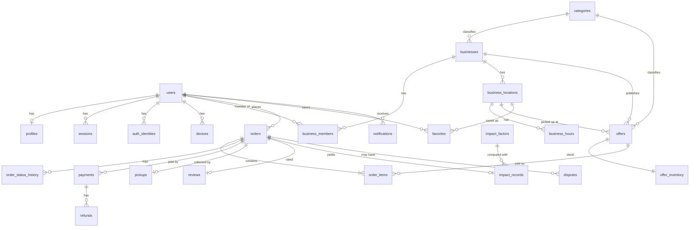

# Database Design — MAWJOOd

PostgreSQL 18 + PostGIS 3.6 (fallback PostgreSQL 17 if the production host lacks 18). Extensions: `postgis`, `citext`, `pg_trgm`, `unaccent`.

## 1. Conventions

| Topic | Rule |
|---|---|
| Primary keys | `uuid`, UUID v7 (time-ordered → good index locality, usable as cursor tiebreaker). PG 18 `uuidv7()` default; generated in the app if on PG 17 |
| Names | `snake_case`, plural tables, `*_id` foreign keys, `*_at` timestamps |
| Time | `timestamptz` everywhere; store-local times derived with the location's IANA `timezone` |
| Money | `bigint` minor units (`*_minor`) + `currency char(3)`; never `float`/`numeric` for app arithmetic |
| Enums | PostgreSQL `text` + `CHECK (col IN (…))` (easier to evolve than native enums); mirrored in `packages/contracts` |
| Audit columns | `created_at`, `updated_at` (trigger), `deleted_at` where soft delete applies |
| Soft delete | users, businesses, business_locations, offers, reviews. **Never** orders, payments, refunds, pickups, audit_logs |
| Integrity | Every rule that can be a constraint **is** a constraint (FK, UNIQUE, CHECK, NOT NULL). App validation is the first line, not the only one |
| Locking | Inventory: conditional atomic `UPDATE`. State changes: conditional `UPDATE … WHERE status = ANY($allowed)`. Optimistic `version` column for merchant edits |
| Isolation | `READ COMMITTED` (default) + the patterns above; `SERIALIZABLE` only where a use case documents why |

## 2. ERD (core)



Supporting tables: `verification_tokens`, `notification_preferences`, `category_translations`, `images`, `idempotency_keys`, `webhook_events`, `pickup_attempts`, `outbox_events`, `audit_logs`, `feature_flags`, `app_config`.

## 3. Tables

Only key columns and constraints shown; full DDL lives in migrations.

### 3.1 Identity

**users** — `id`, `email citext UNIQUE` (nullable only after anonymization), `email_verified_at`, `password_hash` (nullable for OAuth-only), `platform_role CHECK IN ('CUSTOMER','ADMIN','SUPER_ADMIN') DEFAULT 'CUSTOMER'`, `status CHECK IN ('ACTIVE','SUSPENDED','DELETED')`, `mfa_secret_enc` (admins), timestamps, `deleted_at`.

**auth_identities** — `user_id FK`, `provider CHECK IN ('GOOGLE','APPLE')`, `provider_subject`; `UNIQUE (provider, provider_subject)`.

**sessions** (refresh-token families) — `id`, `user_id FK`, `family_id`, `token_hash bytea UNIQUE` (SHA-256), `device_id`, `expires_at`, `absolute_expires_at`, `revoked_at`, `replaced_by_id`, `created_ip_hash`, `user_agent`. Index `(user_id) WHERE revoked_at IS NULL`.

**verification_tokens** — `user_id`, `purpose CHECK IN ('EMAIL_VERIFY','PASSWORD_RESET')`, `code_hash`, `expires_at`, `used_at`, `attempts smallint CHECK (attempts <= 5)`.

**profiles** — `user_id PK/FK`, `display_name`, `avatar_image_id`, `locale`, `dietary_preferences text[]`, `marketing_opt_in boolean DEFAULT false`.

**notification_preferences** — `user_id`, `type`, `push_enabled`, `email_enabled`, `quiet_hours_start time`, `quiet_hours_end time`, `timezone`, `max_per_day smallint CHECK (max_per_day BETWEEN 0 AND 10)`; `PRIMARY KEY (user_id, type)`.

**devices** — `id`, `user_id FK`, `push_token UNIQUE`, `platform CHECK IN ('IOS','ANDROID')`, `app_version`, `locale`, `last_seen_at`, `revoked_at`.

### 3.2 Merchants

**businesses** — `id`, `display_name`, `legal_name`, `slug UNIQUE`, `category_id FK`, `description`, `status CHECK IN ('PENDING_REVIEW','ACTIVE','SUSPENDED','REJECTED')`, `logo_image_id`, `cover_image_id`, `rating_avg numeric(3,2)`, `rating_count int`, timestamps, `deleted_at`.

**business_members** — `business_id FK`, `user_id FK`, `role CHECK IN ('OWNER','STAFF')`, `invited_by`, `created_at`; `PRIMARY KEY (business_id, user_id)`.

**business_locations** — `id`, `business_id FK`, `name`, `address_line`, `city`, `postal_code`, `country_code char(2)`, `geog geography(Point,4326) NOT NULL`, `timezone text NOT NULL`, `phone`, `status`, timestamps, `deleted_at`. Index: `GIST (geog)`.

**business_hours** — `location_id FK`, `weekday smallint CHECK (weekday BETWEEN 0 AND 6)`, `opens_at time`, `closes_at time`; `CHECK (closes_at <> opens_at)` (overnight ranges allowed).

**categories** — `id`, `slug UNIQUE`, `parent_id`, `sort_order`, `active`. **category_translations** — `(category_id, locale) PK`, `name`.

### 3.3 Offers and inventory

**offers**
| Column | Type / constraint |
|---|---|
| `id` | uuid PK |
| `business_id`, `location_id`, `category_id` | FK NOT NULL |
| `title`, `description` | text, length checks |
| `price_minor` | `bigint CHECK (price_minor > 0)` |
| `reference_value_minor` | `bigint NULL CHECK (reference_value_minor IS NULL OR reference_value_minor > price_minor)` |
| `currency` | `char(3) NOT NULL` |
| `pickup_start`, `pickup_end` | `timestamptz`, `CHECK (pickup_end > pickup_start)` |
| `max_per_order` | `smallint CHECK (max_per_order BETWEEN 1 AND 20)` |
| `status` | `CHECK IN ('DRAFT','SCHEDULED','ACTIVE','PAUSED','SOLD_OUT','ENDED','REMOVED')` |
| `allergens`, `dietary_tags` | `text[]` (values validated against contracts) |
| `geog` | `geography(Point,4326)` — denormalized copy of the location point for single-table geo queries; kept in sync by the locations module |
| `search_doc` | `tsvector GENERATED` from title/description (`simple` config + `unaccent`) |
| `version` | int (optimistic locking for merchant edits) |
| timestamps, `deleted_at` | |

Indexes:
- `GIST (geog) WHERE status = 'ACTIVE' AND deleted_at IS NULL` — nearby/viewport queries
- `(location_id, pickup_start)` · `(business_id, status)` · `(pickup_end) WHERE status IN ('ACTIVE','PAUSED','SOLD_OUT')` — expiry job
- `GIN (search_doc)` · `GIN (title gin_trgm_ops)` — search

**offer_inventory** (separate hot row, so frequent stock updates do not rewrite the wide offer row)
| Column | Constraint |
|---|---|
| `offer_id` | PK, FK |
| `quantity_total` | `int CHECK (quantity_total >= 0)` |
| `quantity_available` | `int CHECK (quantity_available >= 0 AND quantity_available <= quantity_total)` |
| `updated_at` | |

Reservation (inside the order transaction):
```sql
UPDATE offer_inventory
   SET quantity_available = quantity_available - $qty, updated_at = now()
 WHERE offer_id = $offerId AND quantity_available >= $qty
RETURNING quantity_available;
-- 0 rows → OFFER_SOLD_OUT. Under READ COMMITTED, concurrent updaters of the same row
-- wait for the lock and then re-check the WHERE clause on the new row version,
-- so the last unit can only be taken once. The CHECK constraint is the backstop.
```
Release (hold expiry / cancellation) adds back the quantity in the **same** transaction as the guarded order-status change, so stock is restored exactly once.

### 3.4 Orders

**orders**
| Column | Constraint / note |
|---|---|
| `id` | uuid PK |
| `short_code` | `text UNIQUE` — human reference (e.g. `MW-7K3Q9`) for support |
| `user_id`, `business_id`, `location_id` | FK |
| `status` | see §4 |
| `subtotal_minor`, `fees_minor`, `discount_minor`, `tax_minor`, `total_minor` | `bigint >= 0`; `CHECK (total_minor = subtotal_minor + fees_minor + tax_minor - discount_minor)` |
| `currency` | char(3) |
| `pickup_start`, `pickup_end`, `pickup_timezone` | **snapshotted** from the offer at purchase |
| `hold_expires_at` | timestamptz |
| `pickup_token_hash` | `bytea UNIQUE` — SHA-256 of the QR token |
| `pickup_code_hash` | `bytea` — hash of the 6-character code, `UNIQUE (location_id, pickup_code_hash)` among non-terminal orders (partial index) |
| `cancelled_reason`, `cancelled_by` | |
| timestamps | |

Indexes: `(user_id, created_at DESC, id)` (order history cursor) · `(location_id, pickup_start) WHERE status IN ('CONFIRMED','READY_FOR_PICKUP')` (merchant today) · `(status, hold_expires_at) WHERE status IN ('CREATED','PAYMENT_PENDING')` (expiry job).

**order_items** — `order_id FK`, `offer_id FK`, `quantity int CHECK (quantity > 0)`, `unit_price_minor`, `reference_value_minor`, `title_snapshot`. (One item per order at MVP; the table allows multi-item orders later.)

**order_status_history** — `order_id`, `from_status`, `to_status`, `actor_type CHECK IN ('CUSTOMER','MERCHANT','ADMIN','SYSTEM','PROVIDER')`, `actor_id`, `reason`, `request_id`, `created_at`.

**idempotency_keys** — `user_id`, `key uuid`, `endpoint`, `request_hash bytea`, `status CHECK IN ('IN_PROGRESS','COMPLETED')`, `recovery_point text`, `order_id`, `locked_until`, `response_status`, `response_body jsonb`, `created_at`, `expires_at` (24 h); `PRIMARY KEY (user_id, key)`.

### 3.5 Payments

**payments** — `id`, `order_id FK`, `provider`, `provider_payment_id`, `status CHECK IN ('PENDING','PROCESSING','PAID','FAILED','CANCELLED','REFUNDED','PARTIALLY_REFUNDED')`, `amount_minor`, `amount_refunded_minor DEFAULT 0 CHECK (amount_refunded_minor BETWEEN 0 AND amount_minor)`, `currency`, `failure_code`, timestamps; `UNIQUE (provider, provider_payment_id)`; partial `UNIQUE (order_id) WHERE status NOT IN ('FAILED','CANCELLED')` — at most one live payment per order.

**refunds** — `id`, `payment_id FK`, `provider_refund_id UNIQUE`, `amount_minor CHECK (> 0)`, `status`, `reason`, `requested_by`, `idempotency_key UNIQUE`.

**webhook_events** — `id`, `provider`, `provider_event_id`, `type`, `payload jsonb`, `received_at`, `processed_at`, `attempts`, `last_error`; `UNIQUE (provider, provider_event_id)` — a duplicate delivery is a no-op insert.

### 3.6 Pickups, favorites, reviews

**pickups** — `id`, `order_id UNIQUE FK` (**DB-level guarantee: one successful pickup per order**), `validated_by_user_id`, `location_id`, `method CHECK IN ('QR','CODE','MANUAL_OVERRIDE')`, `validated_at`, `client_validated_at` (offline), `device_id`, `override_reason`.

**pickup_attempts** — every scan result incl. failures (`result`, `location_id`, `staff_id`, `created_at`) for fraud monitoring; partitioned/purged after 90 days.

**favorites** — `user_id`, `location_id`, `created_at`; `PRIMARY KEY (user_id, location_id)`. Index `(location_id)` for "notify fans of this store".

**reviews** — `id`, `order_id UNIQUE`, `user_id`, `business_id`, `rating smallint CHECK (rating BETWEEN 1 AND 5)`, `comment`, `status CHECK IN ('PUBLISHED','HIDDEN')`, timestamps, `deleted_at`. Only allowed when order is `PICKED_UP` (enforced in use case + trigger check).

### 3.7 Notifications, impact, platform

**notifications** — `id`, `user_id`, `type`, `channel`, `dedupe_key`, `payload jsonb`, `status CHECK IN ('PENDING','SENT','FAILED','SKIPPED')`, `skip_reason`, `scheduled_for`, `sent_at`, `read_at`; `UNIQUE (user_id, dedupe_key)`; index `(user_id, created_at DESC)`.

**impact_factors** — `id`, `version`, `category_id NULL`, `kg_food_per_unit numeric`, `kg_co2e_per_kg_food numeric`, `source_citation text NOT NULL`, `methodology_url`, `valid_from`, `valid_to`. **Values are supplied by the client with sources (D8); nothing is hardcoded.**

**impact_records** — `order_id UNIQUE`, `user_id`, `business_id`, `units`, `kg_food`, `kg_co2e`, `money_saved_minor`, `impact_factor_id FK`, `created_at`.

**images** — `id`, `owner_type`, `owner_id`, `storage_key`, `status CHECK IN ('PENDING','READY','REJECTED')`, `content_type`, `bytes`, `width`, `height`, `blurhash`, `variants jsonb`, `created_by`.

**disputes** — `id`, `order_id`, `opened_by`, `reason`, `status CHECK IN ('OPEN','RESOLVED','REJECTED')`, `resolution`, `refund_id`, timestamps.

**outbox_events** — `id`, `aggregate_type`, `aggregate_id`, `event_type`, `payload jsonb`, `created_at`, `published_at`, `attempts`. Index `(created_at) WHERE published_at IS NULL`.

**audit_logs** — `id`, `actor_user_id`, `actor_role`, `action`, `entity_type`, `entity_id`, `before jsonb`, `after jsonb`, `reason`, `request_id`, `ip_hash`, `created_at`. **Append-only:** the application DB role has `INSERT, SELECT` only (no `UPDATE`/`DELETE`). Monthly partitions once volume warrants.

**feature_flags** — `key PK`, `enabled`, `rollout_percent CHECK (0–100)`, `rules jsonb`, `updated_by`, `updated_at`. **app_config** — `key PK`, `value jsonb`, `updated_by`, `updated_at`.

## 4. State machines

### 4.1 Order

```
CREATED ──▶ PAYMENT_PENDING ──▶ CONFIRMED ──▶ READY_FOR_PICKUP ──▶ PICKED_UP
   │               │                 │                │
   ├─▶ EXPIRED ◀───┤                 ├─▶ CANCELLED ◀──┤
   └─▶ FAILED  ◀───┤                 └─▶ PICKED_UP    └─▶ NO_SHOW
                   └─▶ CANCELLED
```

| From | To | Actor | Condition |
|---|---|---|---|
| CREATED | PAYMENT_PENDING | SYSTEM | Provider payment created |
| CREATED, PAYMENT_PENDING | EXPIRED | SYSTEM | `hold_expires_at < now()`; stock released |
| CREATED, PAYMENT_PENDING | FAILED | PROVIDER/SYSTEM | Payment failed definitively; stock released |
| PAYMENT_PENDING | CANCELLED | CUSTOMER | Customer abandons before paying; stock released |
| PAYMENT_PENDING | CONFIRMED | PROVIDER | Payment `PAID` |
| CONFIRMED | READY_FOR_PICKUP | SYSTEM | `pickup_start <= now()` |
| CONFIRMED | CANCELLED | CUSTOMER (before cutoff), MERCHANT, ADMIN | Refund issued; stock released if window not started |
| READY_FOR_PICKUP | CANCELLED | MERCHANT, ADMIN | Refund issued |
| CONFIRMED, READY_FOR_PICKUP | PICKED_UP | MERCHANT/STAFF | Valid pickup inside window (+ override rules) |
| CONFIRMED, READY_FOR_PICKUP | NO_SHOW | SYSTEM | `pickup_end + grace < now()` |

Terminal: `PICKED_UP`, `CANCELLED`, `EXPIRED`, `FAILED`, `NO_SHOW`.

**Deviation from the brief's example (deliberate):** refunds are tracked on the **payment** (`REFUNDED` / `PARTIALLY_REFUNDED`), not as an order status. An order can be `CANCELLED` *and* refunded, or `PICKED_UP` *and* partially refunded after a dispute. Mixing fulfilment and money in one field would lose information. `NO_SHOW` is added because "paid but not collected" needs its own policy.

Implementation: a pure `OrderStateMachine` in `orders/domain` (unit-tested exhaustively) **plus** a guarded SQL update (`WHERE id = $1 AND status = ANY($allowedFrom)`), plus a row in `order_status_history` in the same transaction. Clients can never send a status.

### 4.2 Payment

```
PENDING ──▶ PROCESSING ──▶ PAID ──▶ PARTIALLY_REFUNDED ──▶ REFUNDED
   │             │            └───────────────────────────▶ REFUNDED
   ├─▶ FAILED ◀──┤
   └─▶ CANCELLED ◀┘
```
Out-of-order webhooks are handled by only allowing forward transitions; a stale event is recorded and ignored.

### 4.3 Offer

`DRAFT → SCHEDULED → ACTIVE ⇄ PAUSED`; `ACTIVE → SOLD_OUT` (stock 0) `→ ACTIVE` (stock restored before window ends); any non-terminal `→ ENDED` (window passed) or `REMOVED` (merchant/admin). Price and pickup window cannot change once any order exists; the merchant must end the offer and create a new one (protects customers who already paid).

## 5. Key queries

```sql
-- Nearby (radius), ordered by distance, keyset-paginated
SELECT o.id, ST_Distance(o.geog, $pt) AS dist_m, …
  FROM offers o JOIN offer_inventory i ON i.offer_id = o.id
 WHERE o.status = 'ACTIVE' AND o.deleted_at IS NULL
   AND ST_DWithin(o.geog, $pt, $radius_m)
   AND o.pickup_end > now()
   AND (ST_Distance(o.geog, $pt), o.id) > ($cursor_dist, $cursor_id)   -- when paging
 ORDER BY dist_m, o.id
 LIMIT $limit + 1;

-- Map viewport
… WHERE o.geog && ST_MakeEnvelope($minLng, $minLat, $maxLng, $maxLat, 4326)::geography …
```

Low-zoom map views use server-side grid clustering (`ST_SnapToGrid` on the geometry, `GROUP BY` cell) so the phone never downloads thousands of points. Exact plans are validated with `EXPLAIN (ANALYZE, BUFFERS)` on seeded data in Phase 4.

## 6. Migrations

- Tool: Kysely `Migrator` with migrations written as raw SQL (`sql\`…\``) in `apps/api/migrations/NNNN_name.ts`, each with `up` and `down` (ADR-007).
- Generated types: `kysely-codegen` runs against a freshly migrated database; CI fails if the committed types differ.
- **Expand → migrate → contract** for every breaking change: add new columns/tables (backward compatible) → deploy code that writes both → backfill in batches → switch reads → remove old in a later release. Mobile apps already in users' hands must keep working.
- Never: manual schema edits in production; `ALTER` that rewrites a large table in one transaction without a plan; `NOT NULL` without a default on a large table in one step; dropping a column the previous app version still reads.
- Every migration is reviewed, tested on a production-sized copy in staging, and recorded with its rollback note in the PR.

## 7. Data lifecycle

| Data | Retention |
|---|---|
| Orders, payments, refunds | Kept for the legal accounting period (to be confirmed by counsel); user link pseudonymized after account deletion |
| Sessions, verification tokens, idempotency keys | Purged after expiry (+7 days) |
| Webhook events | 180 days |
| Pickup attempts, notifications | 90 days |
| Audit logs | ≥ 1 year (confirm with counsel) |
| Precise user location | **Never stored** server-side; requests use it transiently; logs round coordinates to 2 decimals (~1 km) |
